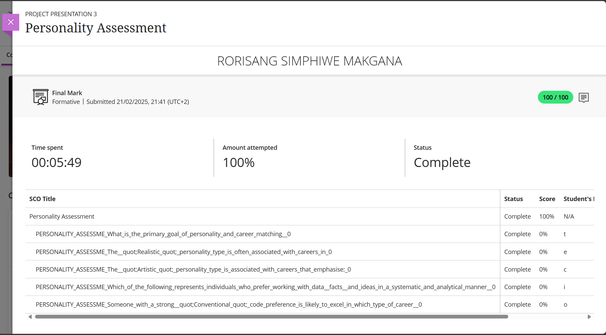

# PRP3-professional_practice_3--Personality_Assessment

## 🧠 3. Personality Assessment

### 📂 Evidence
- 

### 💭 Reflection (STAR)
**S**ituation:
> Within the Project Presentation, we had another formal assessment completed as a means of understanding the personality assessment, which was to understand how we work and communicate, and also identify the core objectives we are aiming for within our careers.  

**T**ask: 
> The goal was to become more self-aware, as understanding ourselves in the larger picture of becoming more ready for the professional work environment we'd be placed in, so we have to understand the core objectives of this course, such as:
 - assessing the primary goal of personality and career matching,
 - having a realistic outlook on our personality types

**A**ction: 
> We had to take the formative assessment of this course as a means of having reflected on how my traits affect collaboration between team members, and having a realistic expectation of what traits I possess as an individual.

**R**esult: 
> I discovered that as an Introverted-Extrovert, I thrive in independent, creative work and value flexible environments and this fits well into the carrer opportunities provided for software engineers.

---
